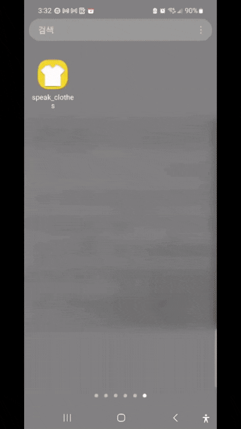
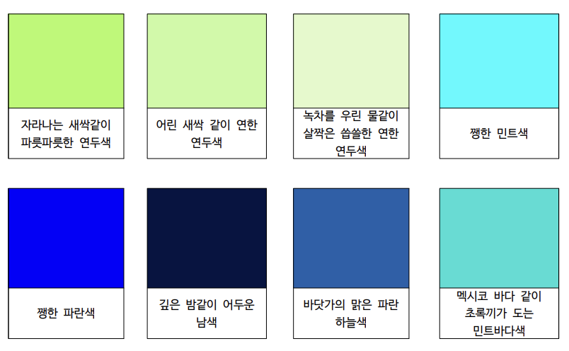

<div align="center">

# 옷을말하다 (Speak-Clothes)
### 시각장애인을 위한 옷 색감 및 종류 음성 안내 앱



>  **안내** : 주 계정 이전(`jga-eun` → `gaeun-jay`)으로 인해 기존 계정인 [@jga-eun](https://github.com/jga-eun) 에서 fork 해 온 프로젝트입니다. 프로젝트 원본 레포지토리 링크는 다음과 같습니다 : [jga-eun/speak-clothes](https://github.com/jga-eun/speak-clothes)

</div>

<br/>

##  &nbsp;수상

**2023 성신여자대학교 AI융합학부 소프트웨어 경진대회 최우수상** (2023.09)

<br/>

##  &nbsp;프로젝트 배경 및 목적

시각장애인이 혼자 옷을 입을 때 색상과 종류를 구분하기 어렵다는 문제에서 출발한 프로젝트입니다. 카메라로 옷을 촬영하면 AI가 색감과 종류를 분석해 음성으로 안내해주는 앱을 개발했습니다.

색을 단순한 색상명이 아닌 **촉각·기억·미각 등 공감각적 표현**으로 안내해 시각장애인이 보다 직관적으로 이해할 수 있도록 했습니다.

<br/>

##  &nbsp;팀 구성 및 담당 역할

- **개발 기간** : 2023.05 ~ 2023.09 (5개월)
- **팀원** : 4명

프로젝트에서 제 역할은 아래와 같습니다

| 구분 | 내용 |
|------|------|
| PM | 프로젝트 전체 일정 관리 및 기획 |
| AI 모델 | Google Vertex AI / Vision AI 모델 학습 및 앱 연동 |
| 데이터 구축 | Firebase를 활용한 공감각적 색 안내 라벨 데이터 구축 |
| Frontend | Flutter 기반 카메라 캡처 로직 구현 |

<br/>

##  &nbsp;공감각적 색 DB 구축

시각장애인은 색을 색상명으로 인지하기 어렵습니다. 이를 해결하기 위해 시각장애인의 색 인지 방식을 사전 조사하고, **촉각·미각·기억·계절감 등 공감각적 언어로 표현한 색 DB를 직접 구축**하였습니다.

- 총 **106개** 컬러 라벨 직접 제작
- 단순 색상명(예: `연두색`) 대신 감각적 묘사(예: `녹차를 우린 물같이 살짝은 씁쓸한 연한 연구색`) 사용
- Firebase Cloud Firestore에 저장하여 별도 서버 없이 앱과 연동

<div align="center">
  
</div>

> 📄 [전체 색 DB 보기](resources/color_db.pdf)

<br/>

##  &nbsp;주요 기능

### 1. 옷 촬영 및 분석
- 카메라로 옷을 촬영하면 AI가 색상과 종류를 자동 분석

### 2. 음성 안내
- Google TTS를 통해 분석 결과를 음성으로 안내

### 3. 공감각적 색 표현
- 색을 단순 색상명이 아닌 촉각·기억·미각 등의 감각적 표현으로 안내

### 4. Firebase 기반 데이터 관리
- 별도 서버 없이 Firebase로 라벨 데이터 운영

<br/>

##  &nbsp;기술 스택

<table>
  <tr>
    <th>분류</th>
    <th>기술</th>
  </tr>
  <tr>
    <td>앱 개발</td>
    <td>
      
      
    </td>
  </tr>
  <tr>
    <td>AI 모델</td>
    <td>
      
      
    </td>
  </tr>
  <tr>
    <td>음성 안내</td>
    <td>
      
    </td>
  </tr>
  <tr>
    <td>데이터베이스</td>
    <td>
      
    </td>
  </tr>
</table>

<br/>

##  &nbsp;프로젝트 구조

```
SpeakClothes/
├── lib/
│   ├── main.dart             # 앱 진입점 및 주요 로직
│   ├── checkAPI.dart         # API 연동 확인
│   └── color.dart            # 색상 데이터 처리
├── resources/
│   ├── speak-clothes-app.gif # 앱 시연 GIF
│   ├── color_db_main.png     # 색 DB 샘플 이미지
│   ├── color_db.pdf          # 전체 색 DB(PDF)
│   └── *.png                 # README 섹션 아이콘
├── assets/                   # 옷을 말하다 앱 아이콘콘
│   ├── speak_clothes_logo.png
│   ├── speak_clothes_logo_icon.png
│   └── speak_clothes_top_icon.png
├── android/                  # Android 플랫폼 설정
├── ios/                      # iOS 플랫폼 설정
├── pubspec.yaml
└── pubspec.lock
```

<br/>

##  &nbsp;설치 및 실행

### 사전 요구사항

- Flutter SDK 3.0.0 이상
- Dart SDK 3.0.0 이상
- Firebase 프로젝트 설정
- Google Cloud (Vertex AI, Vision AI) API 키

### 실행 방법

```bash
git clone <repository-url>
cd speak-clothes
flutter pub get
flutter run
```

> Firebase 및 Google Cloud API 키 설정이 필요합니다. `.env` 파일에 키를 입력해주세요.
